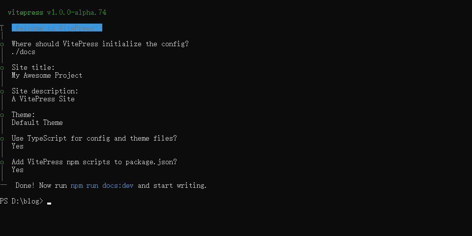

# Vitepress博客搭建

## 安装
通过`NPM`安装：
```shell
npm install -D vitepress
```

初始化，执行这个命令后是交互式的，通常推荐第一个写上`docs`：
```shell
npx vitepress init
```


执行：
```shell
npm run docs:dev
```
> 我是从docsify移植过来的，所以我新建了一个blog文件夹执行了这些操作，然后再把生成的文件复制过来

## 主题
https://theme.sugarat.top/