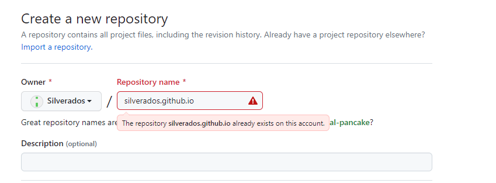
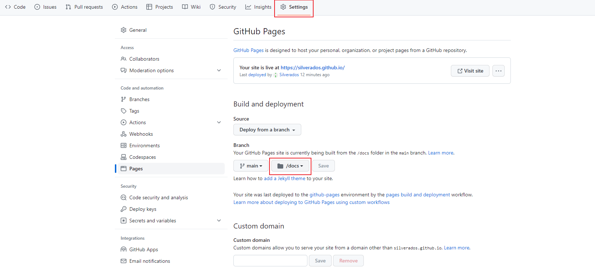

# 博客搭建

## NPM安装

下载网址：https://nodejs.org/en/download

一路安装。

## docsify快速开始

https://docsify.js.org/#/zh-cn/quickstart


打开cmd，输入：

```shell
npm i docsify-cli -g
```


完成后：

```shell
docsify init ./docs
```


成功后提示：

```shell
Initialization succeeded! Please run docsify serve ./docs
```


执行：

```shell
docsify serve ./docs
```

执行后可能会弹安全连接提示，确认即可。


默认端口3000，浏览器输入`http://localhost:3000/`完成。


## Github Pages部署

https://pages.github.com/


1. 创建名为`username.github.io`的仓库。



2. 将上述目录`docs`放入仓库。

3. 仓库中设置分支为`docs`, 保存后稍等几秒即可直接访问:

   


