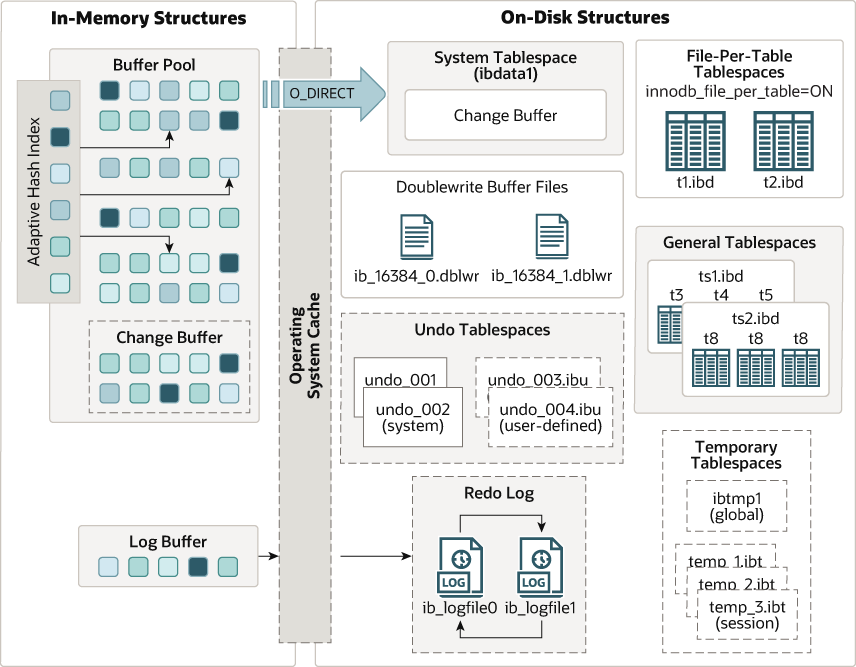

# InnoDB概述
InnoDB引擎架构划分为内存架构和硬盘架构。

其中内存架构包括：
- buffer pool:
- change buffer:
- Adaptive Hash Index:
- Log Buffer:

硬盘架构包括：
- table:
- index:
- tablespace:
- doublewrite buffer:
- redo log:
- undo log:

# 参考文献
https://dev.mysql.com/doc/refman/8.0/en/innodb-architecture.html